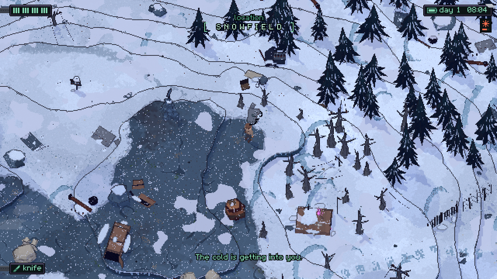
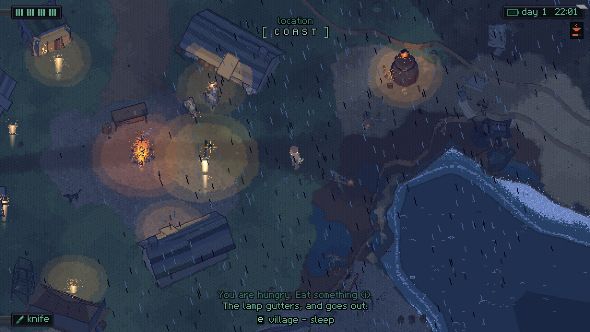

# UNSPENT

A real-time action-survival game on a generated coast, where half-broken machines
work the land and the few people left in it try to live in the gaps. Orthographic
3D rendered at 640×360 and upscaled with nearest filtering, drawn like a field
notebook — washes, inked contours, hatched shade — with a ruler kept for anything
the machines built.

Godot 4.7, GDScript. Everything is generated in code: meshes, sounds, music, the
UI, the world. No imported art, no imported audio.





## Play it

```sh
godot --path .
```

WASD move, Shift run and dodge, Space swing, E use, C make, I carry, M map,
F lamp, Esc pause, ` dev mode (docs/DEV.md).

## Build it

```sh
tools/check.sh          # the gate: tests and real rendered frames, ~35 s
tools/test.sh [filter]  # headless tests
tools/shot.sh out.png   # one real frame of any moment, ~2 s
tools/tour.sh x.tour    # play a scripted sequence through REAL input, a frame per step
tools/canon.sh          # every canon frame beside its accepted twin, on one sheet
tools/export.sh web     # a web build
tools/deploy.sh         # put it on Vercel and prove it runs there in a browser
tools/export.sh web --config=playtest   # a build of a master configuration, stamped
```

A feature is not done because a test passes. It is done when a tour walks to it,
presses the real key, and the frame it saves is worth looking at.

## Where everything is

| | |
|---|---|
| `docs/VISION.md` | where this is going: the machines' plan, 20+ landscape types, sentinels, portals, crafts |
| `docs/ART.md` | the style bible, and it is binding |
| `docs/DESIGN.md` | what the game is now |
| `docs/DEV.md` | dev mode: feedback and testing in any build, master configurations, and making, keeping and shipping builds |
| `docs/ROADMAP.md` | what is next |
| `CLAUDE.md` | the loop, the layout, the conventions, and the contracts parallel work is built against |

## Status

M2. The core loop, six landscapes with two more added as pure data, hazards and
the gear that answers them, machines that mostly ignore you until you interfere,
a UI that is one salvaged tablet, and a score that crosses a border without a
seam. Not a finished game yet — `docs/ROADMAP.md` is honest about what is missing.
